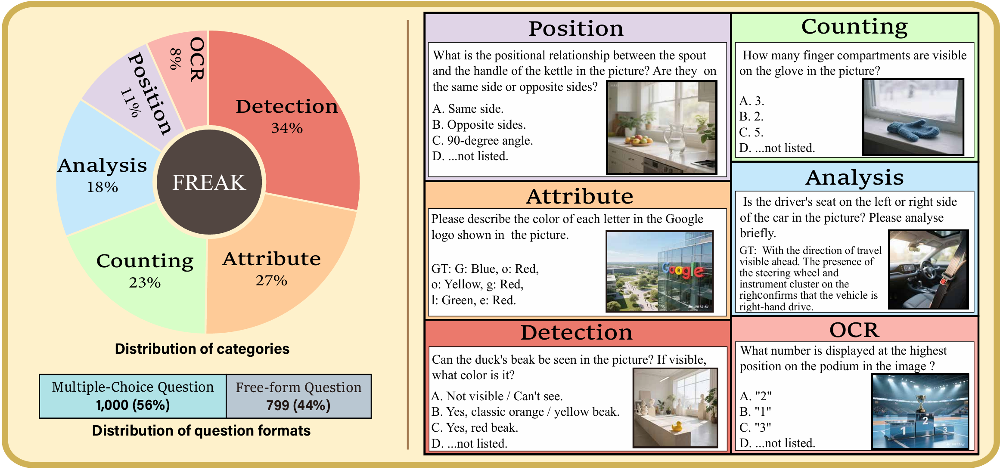

<div align="center">
  <h1 style="font-size: 32px; font-weight: bold;"> [ICLR 2026] FREAK: A Fine-grained Hallucination Evaluation Benchmark for Advanced MLLMs </h1>
<br>
</div>

[](https://openreview.net/forum?id=YeagC09j2K)
[](https://iclr.cc/Conferences/2025)
[](https://huggingface.co/datasets/hansQAQ/FREAK)

*** 

## 📰 News

[2026/2/19] After the double-blind review process, benchmark are released now. Check FREAK benchmark at [Huggingface](https://huggingface.co/datasets/hansQAQ/FREAK)!

[2026/1/26] 🎉🎉 Our paper has been accepted to **ICLR 2026** !


We are finalizing the paper, and the camera-ready version will be uploaded to arXiv and OpenReview shortly.

***

## ✨ Features



**FREAK** is a comprehensive multimodal benchmark designed for fine-grained hallucination assessment in MLLMs. Through high-quality photorealistic images featuring fine-grained counter-commonsense edits, FREAK innovatively evaluates hallucination phenomena in detailed visual perception of MLLMs. Extensive experiments on FREAK show severe hallucination issues in SOTA models regarding detailed visual perception.  The highlights of FREAK lie in:

1. High-quality CCS image input truly challenges Advanced MLLMs perception capability.

2. Comprehensive improvement of existing multimodal hallucination benchmarks with various image and question content.

3. Firstly discuss improvement between reasoning MLLMs and non-reasoning MLLMs in visual perception hallucination.

## 🛠️ Setups

```bash
git clone https://github.com/Hans-M-Yin/FREAK.git

cd FREAK
```

First, install the requirments. 

```bash
conda create -n freak python=3.12
conda activate freak
pip install -r requirements
```

In FREAK, free-form questions rely on an external judge model, so you need to specify the API key and address of the judge model first. You can feel free to try different judge models.

```bash
export OPENAI_API_KEY=<your api key>
export OPENAI_BASE_URL=<your api key>
```

For local MLLMs,  we recommand to install [vLLM]([vllm-project/vllm: A high-throughput and memory-efficient inference and serving engine for LLMs](https://github.com/vllm-project/vllm)) for model deployment. Check *scripts/deploy.sh* for details.


Finally, you can **change params** in  *scripts/run.sh*  and run it!

```bash
python scripts/run.sh
```

## 📊 Results & Leaderboard

Please refer to the [paper](https://openreview.net/pdf?id=YeagC09j2K) for the detailed performance of different MLLMs.

Our leaderboard repored in the paper will be released soon. At the same time, we are integrating the FREAK benchmark into VLMEvalKit. Please stay tuned :)
📚 Citation
--

If you find our paper and code useful for your research and applications, please cite using this BibTeX:

```bash
@inproceedings{
  yin2026freak,        
  title={{FREAK}: A Fine-grained Hallucination Evaluation Benchmark for Advanced {MLLM}s},
  author={Zhihan Yin and Jianxin Liang and Yueqian Wang and Yifeng Yao and Huishuai Zhang and Dongyan Zhao},
  booktitle={The Fourteenth International Conference on Learning Representations},
  year={2026},
  url={https://openreview.net/forum?id=YeagC09j2K}
}
```

📄 License
----------

This project is licensed under the MIT License - see the LICENSE file for details.
